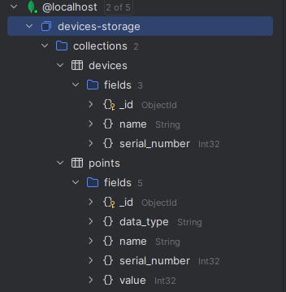
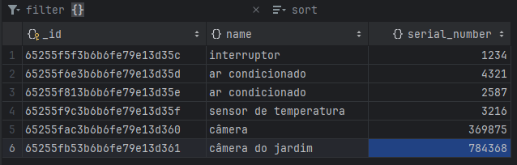
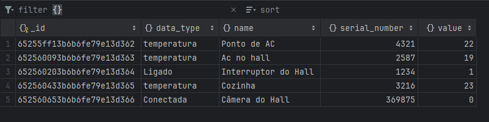

# Back-End application using Python and Flask
This service provides equipment information to a back-end service, connecting the user to a mongoDB database storing the devices, its points and values.

## To run the application simply run the main.py
It provides the following routes:

POST http://localhost:5000/devices 

POST http://localhost:5000/points

GET http://localhost:5000/devices

GET http://localhost:5000/device/{id}

GET http://localhost:5000/points/{serial}

PUT http://localhost:5000/devices/{serial}

PUT http://localhost:5000/points/{serial}

DELETE http://localhost:5000/devices/{serial}

DELETE http://localhost:5000/points/{serial}

`Devices insert request model:
{
    "name": "câmera do jardim",
    "serial_number": 1234
}
`

`Points insert request model:
{
   {
    "name": "Câmera do Jardim",
    "serial_number": 369875,
    "data_type": "Conectada",
    "value": 0
}
}
`
## DB model:

